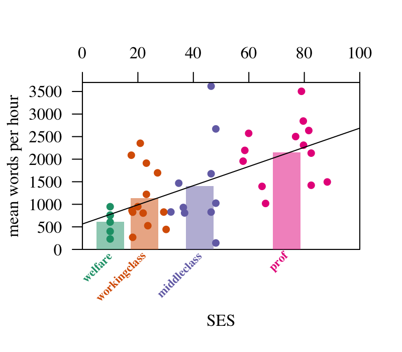

# Hart and Risley 1995

Data are from their 1995 book (appendix A). In addition to the four-level classification of SES, they also have a continuous indicator for SES. I put the bars at the means of the continuous SES indicator.

Sadly, the data are already pooled over the monthly observations per child, so each symbol in the figure represents pooled monthly data for one child (*N=42* children).

