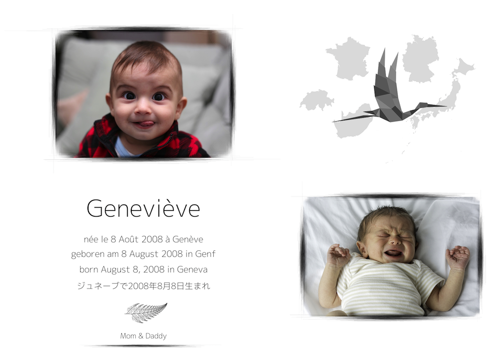

# a birth announcement post card

required packages:

  * `showtext`
  
  * `jpeg`
  
  * `maps`

  * `RColorBrewer`
  
  * `png`

The trickiest thing here is to get the special font for Japanese characters to work. I have to admit that I'm still mystified by how exactly fonts work with the different R graphics devices. That said, the following instructions might not be the most efficient ones, but they do work for me. First off, you need a font with Japanese characters 'installed', and the one I use is 'M+ 2' ([read more here](https://mplus-fonts.osdn.jp/)). The file `mplus-2p-light.ttf` in the `files/` folder contains the necessary data to install that font on your system. On a Mac, just download that file from here (or from the link provided above), open it and select 'install font'. If you run into trouble with the `showtext` package, you might need to install [XQuartz](https://www.xquartz.org/) (see the [discussion here](https://github.com/yixuan/showtext/issues/13)). I don't know how that works on Windows or Linux. Regardless of how you install the font, you will have to 'register' it in R, using the `showtext` package. The first script `01 dealing with fonts.R` lets you test whether this setup worked. But it all can be skipped if you don't want these special fonts in your final card.

Helper functions to create some of the plot elements can be found in `files/plotting_helpers.R`.

One thing that I realized only after doing this is the possibility to use a graphical device whose dimensions can be defined while the output is still visible on the screen. The default RStudio graphics device lacks this option and hence the output generated will look heavily distorted. Only sending the graphics output to the `jpeg()` device (or `png()` or `tiff()`) will generate the final image with the correct dimensions/placement of elements. Instead of the RStudio graphics pane you could also try `quartz()`, `x11()` or `windows()` and set the dimensions there while seeing the output interactively.

The baby images I used come from [Wikipedia](https://en.wikipedia.org/wiki/Infant) and the code for the Barnsley fern is from [here](http://rstudio-pubs-static.s3.amazonaws.com/18905_c8e7a77909704e90a4a38cd3e8bc30f9.html).

